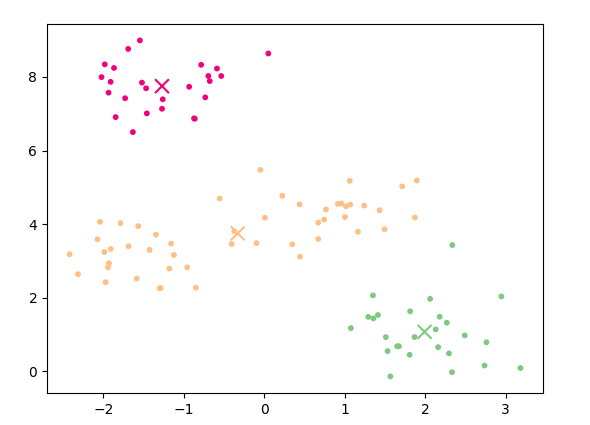

This repository contains an implementation of the K-Means algorithm, developed for Lab 1 of Machine Learning. The focus is on understanding and applying clustering concepts, as well as determining the optimal number of clusters using the Silhouette Coefficient.

---

## Table of Contents

	- [Overview](#overview)
	- [Implemented Requirements](#implemented-requirements)
	- [Project Structure](#project-structure)
	- [How to Run](#how-to-run)
	- [Data Files](#data-files)
	- [Technologies Used](#technologies-used)
	- [Example Results](#example-results)

---

## Overview

K-Means is a simple and effective method to divide a set of **N** data points into **K** clusters. The goal is to make the clusters as "tight" as possible, minimizing the distance between points and their respective cluster center.

In this project:
	-I implemented K-Means from scratch.
	-I visualized how clusters form.
	-I evaluated clustering quality using the Silhouette Coefficient.

---

## Implemented Requirements
	This project implements the following lab requirements:

### K-Means Algorithm:
	- Euclidean distance calculation between points and centroids.
	- Random initialization of centroids.
	- Iterative assignment of points to the closest centroid.
	- Recalculation of centroids as the mean of assigned points.
	- Stop condition based on centroid convergence.

### Cluster Visualization:
- Plot of initial data points.
- Visualization of clustered points with different colors and marked centroids (similar to Lab documentation Figure 2).

### Optimal K with Silhouette Coefficient:
- Compute a(i): average intra-cluster distance for each point.
- Compute b(i): minimum average inter-cluster distance for each point.
- Compute s(i): silhouette value for each point.
- Compute SC: average silhouette coefficient for a given K.
- Identify the K value with the highest SC.

---

## Project Structure
Project_KMeans_Clustering/
├── main.py # Main script: K-Means + visualization
├── data/ # Data files
│ ├── knnpoints3.txt
│ ├── knnpoints4.txt
│ └── knnpoints_uniform.txt
├── images/ 
│ └── kmeans_result.png
├── requirements.txt # Python dependencies
└── README.md # This file

---

## How to Run
1. **Make sure you have pip installed, then run:**
	pip install -r requirements.txt

2. **Run the main script:**
	python main.py

---

## Data Files
The project uses the following datasets, which should be placed in the data/ folder:
	- knnpoints3.txt: Ideal for **K=3**.
	- knnpoints4.txt: Ideal for **K=4**.
	- knnpoints_uniform.txt: Uniformly distributed points, to observe K-Means behavior in such cases

---

## Technologies Used
	- **Python**: Main programming language.
	- **NumPy**: Efficient numerical operations, especially for distance calculations and matrix operations.
	- **Matplotlib**: Visualizing data and clustering results.

---
##Example Results
After running the script, you will see visual plots similar to those from the lab documentation. These include:
	- Initial data points.
	- Clustered points with marked centroids.
	- Silhouette values for various K values.

